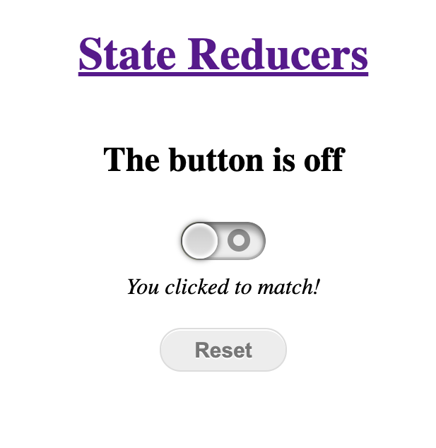

# react-patterns 😺

## Kottans report

### React Patterns
- Default component
- Compound components
- React context
- Render Props
- Props Collections
- Prop Getters
- State Initializers
- State Reducers
- Control Props
- Provider Pattern
- Higher Order Components

### Bonuses
- Reusable Styles
- State Reducers (with change types)
- Proxy component
- Controlled Components (submit form)
- Uncontrolled Components (submit form)

<video width="320" height="240" controls>
  <source src="./public/video.mov" type="video/mp4">
</video>

